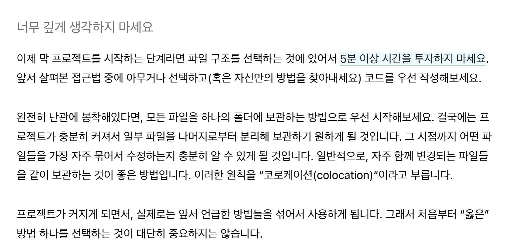
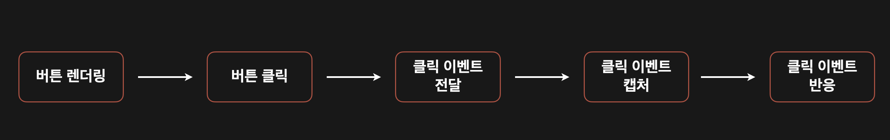
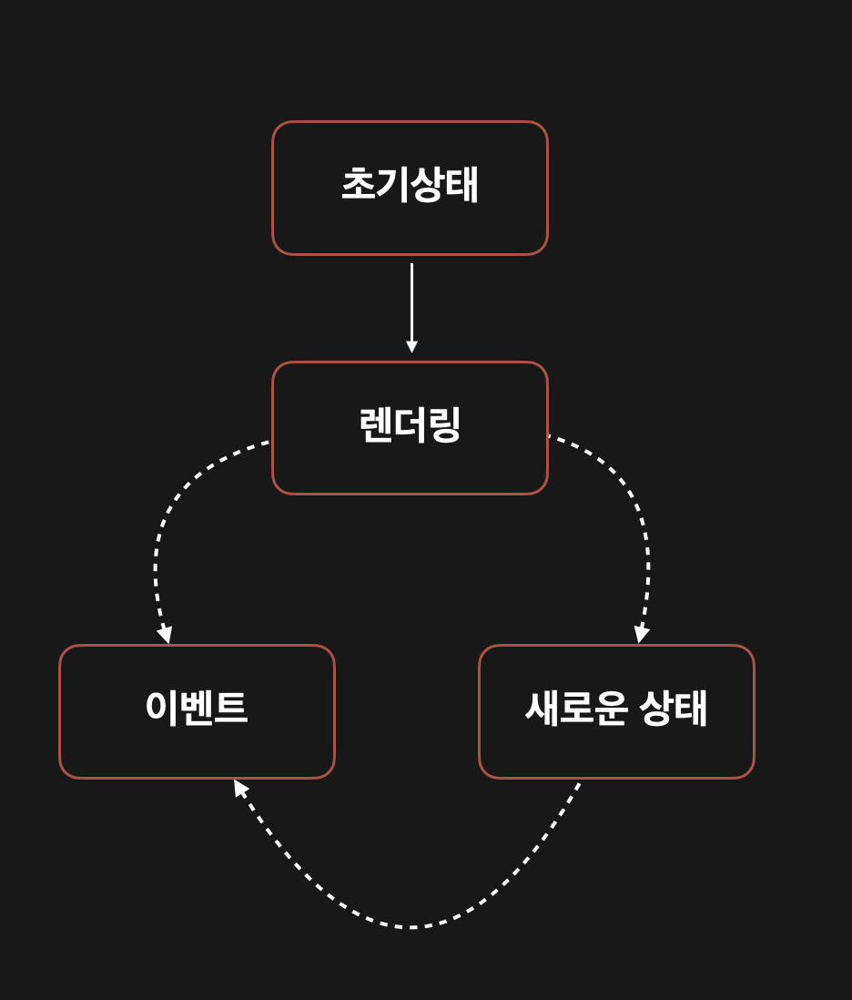

# DOM 이벤트 API

### YAGNI 원칙

3장을 알아보기전에 인상깊었던 YAGNI 원칙을 소개하고자 합니다.

YAGNI는 You Aren’t Gonna Need It의 약자로 “정말 필요하다고 간주할 때까지 기능을 추가하지 마라” 라는 원칙입니다. 우리가 개발을할때 너무 먼 미래를 바라보고 기능을 설계하거나 구현하는건 위험이 따른다는 말입니다.

실제로 React 팀에서도



위와 같이 React Directory Structure의 추천에 대한 답변을 다음과같이 나타내고 있습니다.

### DOM 이벤트 API

이벤트는 웹 어플리케이션에서 발생하는 동작입니다.

다양한 이벤트 타입이 있습니다.

- 마우스 이벤트 (클릭, 더블 클릭 등)
- 키보드 이벤트 (키다운, 키업 등)
- 뷰 이벤트 (뷰 리사이징, 스크롤 등)

을 포함한 사용자가 트리거한 이벤트에 반응 할 수 있습니다.

또한 네트워크의 상태나 DOM 콘텐츠의 변화에 따라 이벤트를 발생시킬 수 있습니다.

뒤에 나올 이벤트 관련 내용을 마우스 이벤트를 중심으로 알아보겠습니다.

마우스 클릭 이벤트 라이프사이클을 참고해주세요



### DOM 이벤트 라이프 사이클

addEventListener 메서드를 사용해 핸들러를 추가하는 코드에는 일반적으로 다음과 같은 내용이 포함됩니다.

```jsx
eventTarget.addEventListener("click", handler, false);
```

여기서 3번째 파라미터는 `useCapture` 이며 기본값은 `false` 입니다.

`useCapture` 는 이벤트 대상의 DOM 트리 하위에 위치한 자손 `EventTarget` 으로 이벤트가 전달되기 전에, 이 수신기가 먼저 발동돼야 함을 나타내는 `boolean` 값입니다.

이를 `true` 로 설정했을 때 어떻게 동작하는지 아래 코드를 통해 알아보겠습니다.

```jsx
<body>
	<div>
		this is a container
		<button>Click here</button>
	</div>
</body>

const button = document.querySelector('button')
const div = document.querySelector('div')

div.addEventListener('click', () => console.log('Div Clicked'), false)
div.addEventListener('click', () => console.log('Button Clicked', false)
```

`<button />` 을 클릭하면 `<div />` 안에 있기 때문에 두 이벤트 핸들러가 동작합니다. 이벤트 객체는 기본적으로 트리거된 DOM 노드에서 시자해 모든 조상 노드까지 올라가는 메커니즘을 가지고있는데 우리는 이를 이벤트 버블링이라고 합니다.

이를 중지하는 방법은 아래를 참고해주세요.

```jsx
const button = document.querySelector("button");
const div = document.querySelector("div");

div.addEventListener("click", () => console.log("Div Clicked"), false);
div.addEventListener(
  "click",
  (e) => {
    e.stopPropagation();
    console.log("Button Clicked");
  },
  false
);
```

위 예제에서는 div 핸들러는 동작하지 않습니다. button 핸들러에서 `e.stopPropagation()` 을 이용해서 이벤트에 전파를 막아서 가능합니다.

하지만 이 방법은 위와같이 간단한 로직에서는 빠르게 처리할 수 있어 유용할 수 있으나 핸들러의 순서에 의존하는 경우 다양한 핸들러가 존재한다면 이를 모두 컨트롤하기 쉽지 않을 수 있습니다.

그러면 `useCapture` 를 이용해서 이벤트 핸들러의 순서를 바꿔보겠습니다. 아래 예제를 참고해주세요.

```jsx
const button = document.querySelector('button')
const div = document.querySelector('div')

div.addEventListener('click', () => console.log('Div Clicked'), true)
div.addEventListener('click', () => console.log('Button Clicked', true)
```

위 코드의 실행결과는 다음과 같습니다.

```jsx
// output

1. Div Clicked
2. Button Clicked
```

보시는것과 같이 `useCapture` 를 사용하면 핸들러의 실행 순서를 반대로 할 수 있습니다.

즉, `addEventListener` 를 호출할때 `useCapture` 파라미터에 `true` 값을 주게되면 버블 단계 대신에 캡쳐 단계에 이벤트 핸들러를 추가한다는 것을 의미합니다.

여기서 정리해보면

> 캡쳐 단계: 이벤트가 html에서 목표 요소로 이동한다. (하향식)

> 목표 단계: 이벤트가 목표 요소에 도달한다. (상향식)

> 버블 단계: 이벤트가 목표 요소에서 html로 이동한다.

### TODO MVC에 이벤트 추가

지금까지 간단한 예제들로 DOM 이벤트 API에 기본 개념을 알아봤으니 간단한 TODO Application 으로 이벤트를 활용하는 방법에 대해서 알아봅시다.

### 이벤트 처리 아키텍쳐

모든 이벤트 다음에 상태를 조작한 후 새로운 상태로 메인 렌더링 함수를 호출합니다. 이 설명을 돕기 위해 아래 사진을 참고해주세요



TODO Application에서 간단한 케이스를 가정하고 각자의 상태를 정리해봅시다.

사용자가 리스트에서 항목을 추가하고 삭제하는 것으로 기능을 가정하겠습니다.

- 초기 상태: 비어있는 TODO 리스트
- 렌더링 : 사용자에게 비어있는 리스트를 표시
- 이벤트: 사용자가 ‘list'라는 새 항목을 생성
- 새로운 상태: 하나의 데이터를 가진 todo 리스트
- 렌더링: 사용자에게 하나의 데이터를 가진 리스트 표시
- 이벤트: 사용자가 항목을 삭제
- 새로운 상태: 비어있는 todo 리스트
- 렌더링: 사용자에게 비어있는 리스트를 표시

렌더링 과정과 기능에 대한 명세를 진행했으니 코드로 옮겨 더 자세하게 알아봅시다.

```jsx
const state = {
  todos: [],
  currentFilter: "All",
};

const events = {
  deleteItem: (index) => {
    state.todos.splice(index, 1);
    render();
  },
  addItem: (text) => {
    state.todos.push({
      text,
      completed: falsde,
    });
    render();
  },
};

const render = () => {
  window.requestAnimationFrame(() => {
    const main = document.querySelector("#root");

    const newMain = registry.renderRoot(main, state, events);

    applyDiff(document.body, main, newMain);
  });
};
```

위 예제는 삭제와, 추가 이벤트를 가지고있는 컨트롤러입니다.

바로 추가 이벤트를 가진 application을 구성해보겠습니다.

```jsx
let template;

const getTemplate = () => {
  if (!template) {
    template = document.getElementById("todo-app");
  }

  return template.content.firstElementChild.cloneNode(true);
};

const addEvents = (targetElement, events) => {
  targetElement.querySelector(".new-todo").addEventListener("keypress", (e) => {
    if (e.key === "Enter") {
      events.addItem(e.target.value);
      e.target.value = "";
    }
  });
};

export default (targetElement, state, events) => {
  const newApp = targetElement.cloneNode(true);

  newApp.innerHTML = "";
  newApp.appendChild(getTemplate());

  addEvents(newApp, events);

  return newApp;
};
```

기본적으로 이벤트를 만드는 방식은 우리가 초반에 알아보았던 DOM API와 똑같은 형태로 구현되는것을 확인하 수 있습니다.

### 이벤트 위임

이벤트 위임은 우리가 아는 대부분의 프론트엔드 프레임워크, 라이브러리에서 제공되는 기능입니다.

이벤트 위임을 더 잘 이해하기 위해 아래 예제를 참고해주세요.

```jsx
let template;

const createNewTodoNode = () => {
  if (!template) {
    template = document.getElementById("todo-item");
  }

  return template.content.firstElementChild.cloneNode(true);
};

const getTodoElement = (todo, index) => {
  const { text, completed } = todo;

  const element = createNewTodoNode();

  element.querySelector("input.edit").value = text;
  element.querySelector("label").textContent = text;

  if (completed) {
    element.classList.add("completed");
    element.querySelector("input.toggle").checked = true;
  }

  element.querySelector("button.destroy").dataset.index = index;

  return element;
};

export default (targetElement, state, events) => {
  const { todos } = state;
  const { deleteItem } = events;
  const newTodoList = targetElement.cloneNode(true);

  newTodoList.innerHTML = "";

  todos
    .map((todo, index) => getTodoElement(todo, index))
    .forEach((element) => {
      newTodoList.appendChild(element);
    });

  newTodoList.addEventListener("click", (e) => {
    if (e.target.matches("button.destroy")) {
      deleteItem(e.target.dataset.index);
    }
  });

  return newTodoList;
};
```

이전의 알아보았던 예제와 비교해보면 리스트 자체에 하나의 이벤트 핸들러만 연결되어있는것을 볼 수 있습니다.
