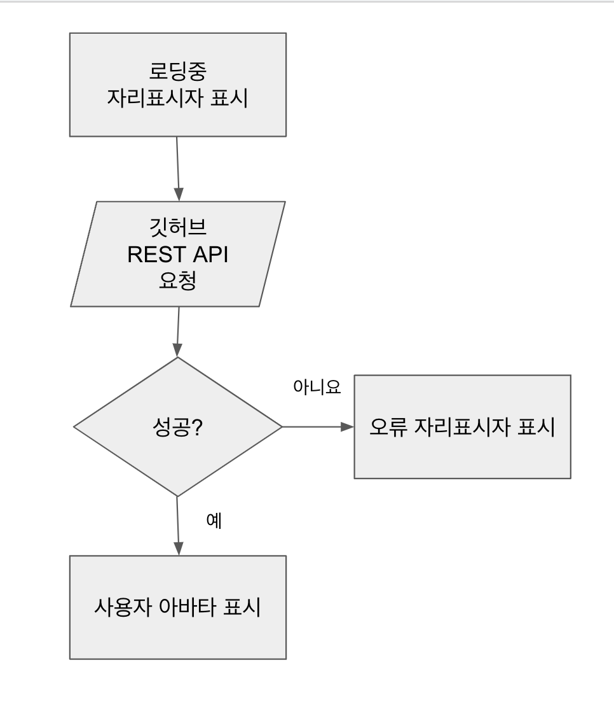
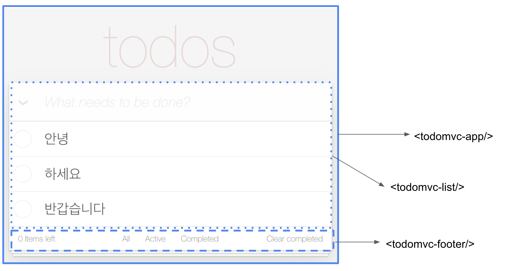

# 04 웹 구성 요소(Web Component)

프론트엔드 프레임워크에는 공통점이 있다.
모든 UI 구성을 위한 기본 블록으로 구성 요소(이하 Component로 명칭)를 사용한다.
최신 브라우저에서 웹 구성 요소(이하 Web Component로 명칭)라고 하는 네이티브 API 세트를 사용해 웹 애플리케이션의 Component를 작성 할 수 있다.

## Web Component API

Web Component는 세 가지 중요 기술로 구성된다.

- HTML 템플릿 : `<template>` 태그는 콘텐츠가 렌더링 되지는 않지만 자바스크립트 코드에서 동적인 콘텐츠를 생성하는데 '스탬프'로 사용되도록 하려는 경우에 유용하다.
- 사용자 정의 요소(이하 Custom Elements) : 이 API를 통해 개발자는 완전한 기능을 갖춘 자신만의 DOM 요소를 작성할 수 있다.
- 섀도우(Shadow) DOM : 이 기술은 Web Component가 Component 외부의 DOM에 영향을 받지 않아야 하는 경우에 유용하다.(캡슐화) 다른 사람들과 공유할 수 있도록 Component 라이브러리나 위젯을 작성하려는 경우 매우 유용하다.

### Custom Elements(사용자 정의 요소)

Custom Elements API는 Web Component의 핵심 요소다. 간단히 말해 다음과 같이 Custom HTML 태그를 작성 할 수 있다.

```html title="Custom HTML tag"
<app-calendar />
```

Web Component 태그를 작성할때는 `-(hypen)`이 필수로 두 단어 이상의 태그를 사용해야 한다.
한 단어 태그는 W3C에서만 단독으로 사용할 수 있다.

`<hello-world>` Custom Element를 만드는 예제를 살펴보자.

```javascript title="hello-world custom elements"
// HelloWorld.js
export default class HelloWorld extends HTMLElement {
  connectedCallback () {
    window.requestAnimationFrame(() => {
      this.innerHTML = '<div>Hello World!</div>'
    })
  }
}

// index.js
import HelloWorld from './components/HelloWorld.js'

window
  .customElements
  .define('hello-world', HelloWorld)


// index.html
<body>
  <hello-world />
</body>
```

- `connectedCallback`은 Custom Element의 라이프사이클 메서드 중 하나다. 이 메서드는 Component가 DOM에 연결될 때 호출 된다. 리액트의 `componentDidMount` 메서드와 매우 유사하다. 예제처럼 Component의 콘텐츠를 렌더링하거나 타이머를 시작하거나 또는 네트워크에서 데이터를 가져오기에 좋은 장소이다.
- `disconnectedCallback`은 Component가 DOM에서 삭제될 때 호출 되며, 정리 작업에 유용한 메서드다.

클래스로 새로 생성한 Custom Element를 사용하려면 브라우저 Component 레지스트리에 추가해야 된다.
이때, `window.customElements` 속성의 `define` 메서드를 사용한다.

### 속성(attributes) 관리

Web Component의 가장 중요한 기능은 개발자가 어떤 프레임워크와도 호환되는 새로운 Component를 만들 수 있다는 것이다. 이 목적을 달성하려면 Component에 다른 표준 HTML 요소와 동일 공용 API가 있어야 한다.
`<input>` 과 같은 표준 요소의 경우 세 가지 방법으로 속성을 설정할 수 있다.(value 속성 변경)

```javascript title="input 속성 정의"
// 1번째 HTML마크에 직접 추가
<input text="text" value="Frameworkless">

// 2번째 세터(setter) 사용
input.value = "Frameworkless"

// 3번째 setAttributes 메서드 사용
input.setAttribute('value', 'Frameworkless')
```

세 가지 방법 모두 동일한 결과, 즉 `input` 요소의 `value` 속성을 변경한다. 또한 동기화되서 마크업을 통해 입력 값을 변경하면 게터(getter)나 `getAttribute` 메서드로 동일한 값을 읽을 수 있고, 세터(setter)나 `setAttriute` 메서드로 값을 변경하면 마크업이 새 속성과 동기화된다.

`HelloWorld` 에 `color` 속성을 추가해보자.

```javascript title="속성을 가진 HelloWorld"
// HelloWorld.js
const DEFAULT_COLOR = "black";

export default class HelloWorld extends HTMLElement {
  get color() {
    return this.getAttribute("color") || DEFAULT_COLOR;
  }

  set color(value) {
    this.setAttribute("color", value);
  }

  connectedCallback() {
    window.requestAnimationFrame(() => {
      const div = document.createElement("div");
      div.textContent = "Hello World!";

      div.style.color = this.color;

      this.appendChild(div);
    });
  }
}

// index.html
<body>
  <hello-world></hello-world>
  <hello-world color="red"></hello-world>
  <hello-world color="green"></hello-world>
  <script type="module" src="index.js"></script>
</body>;
```


### attributeChangedCallback

초기 렌더링 이후 클린 이벤트 핸들러로 속성을 변경 할 경우에는 화면에 반영되지 않는다.

```javascript title="HelloWorld Component의 색상 변경"
const changeColorTo = (color) => {
  document.querySelector("hello-world").forEach((helloWorld) => {
    helloWorld.color = color;
  });
};

document.querySelector("button").addEventListener("click", () => {
  changeColorTo("blue");
});
```

이에 대한 지저분한 해결책은 세터(setter)에 일종의 DOM 조작을 추가하는 것이다.

```javascript
set color (value) {
  this.setAttribute('color', value)
  // 새로운 색상으로 DOM으로 업데이트
  this.div.style.color = value // 이런식으로?
}
```

세터(대신) `setAttibutes(3번재 방법)`를 사용해도 DOM 업데이트가 되지 않기 때문에 좋지 않다.
이때, `attributeChangedCallback` 메서드를 사용한다. 이 메서드는 이름에서 알 수 있듯이 속성이 변경될때마다 호출된다. 변경된 속성의 이름, 속성의 이전 값, 속성의 새로운 값이라는 세 가지 매개변수를 받는다.

> 모든 속성이 attributeChangedCallback을 트리거하지 않고, observedAttributes 배열에 나열된 속성만 트리거한다.

```javascript title="레이블 색상 업데이트"
const DEFAULT_COLOR = "black";

export default class HelloWorld extends HTMLElement {
  static get observedAttributes() {
    return ["color"];
  }

  get color() {
    return this.getAttribute("color") || DEFAULT_COLOR;
  }

  set color(value) {
    this.setAttribute("color", value);
  }

  attributeChangedCallback(name, oldValue, newValue) {
    if (!this.div) {
      return;
    }

    if (name === "color") {
      this.div.style.color = newValue;
    }
  }

  connectedCallback() {
    window.requestAnimationFrame(() => {
      const div = document.createElement("div");
      div.textContent = "Hello World!";
      div.style.color = this.color;
      this.appendChild(div);
    });
  }
}
```

### 가상 DOM 통합

2장의 가상 DOM 알고리즘은 모든 Custom Element에 완벽하게 플러그인 될 수 있다.
색상이 변경될 때마다 가상 DOM 알고리즘을 호출해 레이블의 색상을 수정한다.
지금 코드에서 가상 DOM을 사용하는건 과도하긴 하지만 많은 속성을 가진 경우에 유용하다.

```javascript title="사용자 정의 요소에서 가상 DOM 사용"
import applyDiff from "./applyDiff.js";

const DEFAULT_COLOR = "black";

const createDomElement = (color) => {
  const div = document.createElement("div");
  div.textContent = "Hello World!";
  div.style.color = color;
  return div;
};

export default class HelloWorld extends HTMLElement {
  static get observedAttributes() {
    return ["color"];
  }

  get color() {
    return this.getAttribute("color") || DEFAULT_COLOR;
  }

  set color(value) {
    this.setAttribute("color", value);
  }

  attributeChangedCallback(name, oldValue, newValue) {
    if (!this.hasChildNodes()) {
      return;
    }

    applyDiff(this, this.firstElementChild, createDomElement(newValue));
  }

  connectedCallback() {
    window.requestAnimationFrame(() => {
      this.appendChild(createDomElement(this.color));
    });
  }
}
```

### 사용자 정의 이벤트(Custom Event)

`GitHubAvatar`라는 깃허브 사용자의 아바타를 보여주는 Custom Element를 살펴보자.
이 Component를 사용하려면 user 속성을 설정해야 한다.

```javascript
<github-avatar user="francesco-strazzullo"></github-avatar>
```



`GitHubAvatar` Component의 코드를 살펴보자.(단순화를 위해 `attributeChangedCallback` 메서드로 `user` 속성의 변경을 관리하지 않았다.)

```javascript title="GitHubAvatar 구성 요소"
const ERROR_IMAGE = "https://files-82ee7vgzc.now.sh";
const LOADING_IMAGE = "https://files-8bga2nnt0.now.sh";

const getGitHubAvatarUrl = async (user) => {
  if (!user) {
    return;
  }

  const url = `https://api.github.com/users/${user}`;

  const response = await fetch(url);
  if (!response.ok) {
    throw new Error(response.statusText);
  }
  const data = await response.json();
  return data.avatar_url;
};

export default class GitHubAvatar extends HTMLElement {
  constructor() {
    super();
    this.url = LOADING_IMAGE;
  }

  get user() {
    return this.getAttribute("user");
  }

  set user(value) {
    this.setAttribute("user", value);
  }

  render() {
    window.requestAnimationFrame(() => {
      this.innerHTML = "";
      const img = document.createElement("img");
      img.src = this.url;
      this.appendChild(img);
    });
  }

  async loadNewAvatar() {
    const { user } = this;
    if (!user) {
      return;
    }
    try {
      this.url = await getGitHubAvatarUrl(user);
    } catch (e) {
      this.url = ERROR_IMAGE;
    }

    this.render();
  }

  connectedCallback() {
    this.render();
    this.loadNewAvatar();
  }
}
```

Component 외부에서 HTTP 요청 결과에 반응하려면 어떻게 해야 할까?
DOM이벤트를 사용한다.(Custom Event를 사용)

**_이해하기 어려움_**

> 이는 브라우저와 사용자 간 상호작용이 아닌 도메인에 국한된 DOM 이벤트를 생성할 수 있게 해준다?
> 브라우저, 사용자간 이벤트가 아니고 'GithubAvatar내에서 사용되는 DOM 이벤트이다'라고 해석했는데 맞을까요?

새로운 버전의 `GitHubAvatar` Component에서는 아바타가 로드됐을때와 오류가 발생했을 때의 두 가지 이벤트를 발생시킨다.

```javascript title="사용자 정의 이벤트를 가진 GithubAvatar"
// GithubAvatar.js
//...
const AVATAR_LOAD_COMPLETE = "AVATAR_LOAD_COMPLETE";
const AVATAR_LOAD_ERROR = "AVATAR_LOAD_ERROR";

export const EVENTS = {
  AVATAR_LOAD_COMPLETE,
  AVATAR_LOAD_ERROR,
};

// ...getGitHubAvatarUrl

export default class GitHubAvatar extends HTMLElement {
  // ...
  onLoadAvatarComplete() {
    const event = new CustomEvent(AVATAR_LOAD_COMPLETE, {
      detail: {
        avatar: this.url,
      },
    });

    this.dispatchEvent(event);
  }

  onLoadAvatarError(error) {
    const event = new CustomEvent(AVATAR_LOAD_ERROR, {
      detail: {
        error,
      },
    });

    this.dispatchEvent(event);
  }

  async loadNewAvatar() {
    const { user } = this;
    if (!user) {
      return;
    }
    try {
      this.url = await getGitHubAvatarUrl(user);
      this.onLoadAvatarComplete();
    } catch (e) {
      this.url = ERROR_IMAGE;
      this.onLoadAvatarError(e);
    }

    this.render();
  }
  // ...
}

// index.js
import GitHubAvatar, { EVENTS } from "./components/GitHubAvatar.js";

window.customElements.define("github-avatar", GitHubAvatar);

document.querySelectorAll("github-avatar").forEach((avatar) => {
  avatar.addEventListener(EVENTS.AVATAR_LOAD_COMPLETE, (e) => {
    console.log("Avatar Loaded", e.detail.avatar);
  });

  avatar.addEventListener(EVENTS.AVATAR_LOAD_ERROR, (e) => {
    console.log("Avatar Loading error", e.detail.error);
  });
});
```

## TodoMVC에 Web Component 사용

아래 이미지처럼 TodoMVC 애플리케이션을 `todomvc-app`,`todomvc-list`,`todomvc-footer` 세 개의 Component로 나눈다.


먼저 애플리케이션의 HTML부분을 살펴보자. `<template>` 요소를 광범위하게 사용했다.

```javascript title="Web Component를 가진 TodoMVC 애플리케이션용 HTML"
<template id="footer">
        <footer class="footer">
            <span class="todo-count">
            </span>
            <ul class="filters">
                <li>
                    <a href="#/">All</a>
                </li>
                <li>
                    <a href="#/active">Active</a>
                </li>
                <li>
                    <a href="#/completed">Completed</a>
                </li>
            </ul>
            <button class="clear-completed">
                Clear completed
            </button>
        </footer>
    </template>
    <template id="todo-item">
        <li>
            <div class="view">
                <input class="toggle" type="checkbox">
                <label></label>
                <button class="destroy"></button>
            </div>
            <input class="edit">
        </li>
    </template>
    <template id="todo-app">
        <section class="todoapp">
            <header class="header">
                <h1>todos</h1>
                <input class="new-todo" placeholder="What needs to be done?" autofocus>
            </header>
            <section class="main">
                <input id="toggle-all" class="toggle-all" type="checkbox">
                <label for="toggle-all">
                    Mark all as complete
                </label>
                <todomvc-list></todomvc-list>
            </section>
            <todomvc-footer></todomvc-footer>
        </section>
    </template>
    <todomvc-app></todomvc-app>
```

코드를 단순하게 유지하고자 전체 TodoMVC의 여러 이벤트중, 항목을 추가, 삭제하는 두 가지만 구현했다. 이 방식으로 `todomvc-footer` 코드는 건너뛰고 `todomvc-app`,`todomvc-list`에 집중할 수 있다.

List 코드는 대부분 3장의 코드와 유사하다. 차이점 중 하나는 사용자가 `Destroy` 버튼을 클릭할 때 발생하는 상황을 Custom Event(EVENTS.DELETE_ITEM)로 외부에 알리는 것이다.
todo리스트를 입력받고 todos속성이 변경될때마다 렌더링 된다.

```javascript title="TodoMVC 리스트 Web Component"
// List.js
const TEMPLATE = '<ul class="todo-list"></ul>';

export const EVENTS = {
  DELETE_ITEM: "DELETE_ITEM",
};

export default class List extends HTMLElement {
  static get observedAttributes() {
    return ["todos"];
  }

  get todos() {
    if (!this.hasAttribute("todos")) {
      return [];
    }

    return JSON.parse(this.getAttribute("todos"));
  }

  set todos(value) {
    this.setAttribute("todos", JSON.stringify(value));
  }

  onDeleteClick(index) {
    const event = new CustomEvent(EVENTS.DELETE_ITEM, {
      detail: {
        index,
      },
    });

    this.dispatchEvent(event);
  }

  createNewTodoNode() {
    // console.log(this.itemTemplate.content.firstElementChild);
    // console.log(this.itemTemplate.content);
    // console.log(this.itemTemplate);
    return this.itemTemplate.content.firstElementChild.cloneNode(true);
  }

  getTodoElement(todo, index) {
    const { text, completed } = todo;

    const element = this.createNewTodoNode();

    element.querySelector("input.edit").value = text;
    element.querySelector("label").textContent = text;

    if (completed) {
      element.classList.add("completed");
      element.querySelector("input.toggle").checked = true;
    }

    element.querySelector("button.destroy").dataset.index = index;

    return element;
  }

  updateList() {
    this.list.innerHTML = "";
    console.log(this.todos.map(this.getTodoElement.bind(this)));
    this.todos.map(this.getTodoElement.bind(this)).forEach((element) => {
      this.list.appendChild(element);
    });
  }

  connectedCallback() {
    console.log(this);
    this.innerHTML = TEMPLATE;
    this.itemTemplate = document.getElementById("todo-item");

    this.list = this.querySelector("ul");

    this.list.addEventListener("click", (e) => {
      if (e.target.matches("button.destroy")) {
        this.onDeleteClick(e.target.dataset.index);
      }
    });

    this.updateList();
  }

  attributeChangedCallback() {
    this.updateList();
  }
}
```

이제 Application 코드를 살펴보자.
이 Component는 속성이 없는 대신 내부 상태(state)를 가진다.
DOM의 이벤트는 이 상태를 변경한 다음 Component가 `syncAttributes` 메서드에서 해당 상태를 하위 속성과 동기화 한다.

```javascript title="TodoMVC 애플리케이션 Component"
// Application.js
import { EVENTS } from "./List.js";

export default class App extends HTMLElement {
  constructor() {
    super();
    this.state = {
      todos: [],
      filter: "All",
    };

    this.template = document.getElementById("todo-app");
  }

  deleteItem(index) {
    this.state.todos.splice(index, 1);
    this.syncAttributes();
  }

  addItem(text) {
    this.state.todos.push({
      text,
      completed: false,
    });
    this.syncAttributes();
  }

  syncAttributes() {
    this.list.todos = this.state.todos;
    this.footer.todos = this.state.todos;
    this.footer.filter = this.state.filter;
  }

  connectedCallback() {
    window.requestAnimationFrame(() => {
      const content = this.template.content.firstElementChild.cloneNode(true);

      this.appendChild(content);

      this.querySelector(".new-todo").addEventListener("keypress", (e) => {
        if (e.key === "Enter") {
          this.addItem(e.target.value);
          e.target.value = "";
        }
      });

      this.footer = this.querySelector("todomvc-footer");

      this.list = this.querySelector("todomvc-list");
      this.list.addEventListener(EVENTS.DELETE_ITEM, (e) => {
        this.deleteItem(e.detail.index);
      });

      this.syncAttributes();
    });
  }
}
```

## 웹 구성 요소와 렌더링 함수

**_이해하기 어려움_**
Web Component와 렌더링 함수 접근 방식(2장,3장 코드)을 비교해보자.
그 다음, DOM 요소를 렌더링하는 두 가지 방법의 장단점을 알아보자.

### 코드 스타일

Web Component를 작성하려면 HTML Element를 확장해야 하므로 Class작업이 필요하다.
둘 중 승자는 없다. 좋아하는것을 사용하면 된다.

**_이해하기 어려움_**

> 마지막 TodoMVC 구현에서 봤듯이 렌더링 함수를 가져와 Web Component로 래핑하면 디자인을 시나리오에 맞출 수 있다. 예를 들면 먼저 간단한 렌더링 함수로 시작한 후 라이브러리로 릴리스해야 하는 경우네느 Web Component로 래핑하면 된다.
> 렌더링 함수로 작업한 코드를 릴리스해야 될 경우 Web Component에 래핑하면 된다.

### 테스트 가능성

렌더링 함수를 테스트하려면 `jest`같은 `JSDOM` 통합 테스트 러너를 사용하면 된다.
`JSDOM`은 사용자 정의요소(Custom Element)를 지원하지 않는다.
사용자 정의 요소를 테스트하려면 [퍼페티어(Puppeteer)](https://developers.google.com/web/tools/puppeteer)를 사용해야 하지만 테스트 속도가 느리고 복잡하다.

### 휴대성

Web Component는 휴대성이 좋아야 한다. 다른 DOM요소와 동일하게 동작한다는 사실은 다른 애플리케이션 간에 동일한 Component를 사용해야 하는 경우 핵심 기능이 왼다.

### 커뮤니티

Component 클래스는 대부분의 프레임워크에서 DOM UI 요소를 작성하는 표준 방법이다. 대규모 팀이나 빠르게 성장하는 팀이라면 명심해야 할 아주 유용한 기능이다. 사람들에게 익숙한 코드가 더 읽기 쉬운 코드가 된다.
