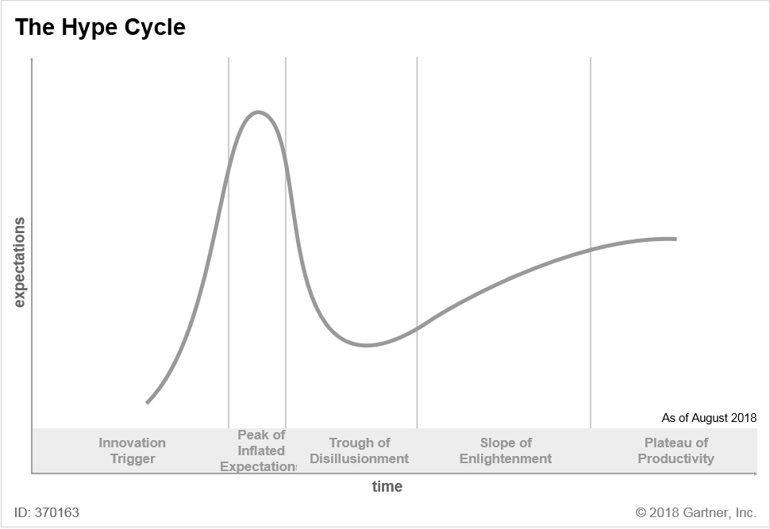
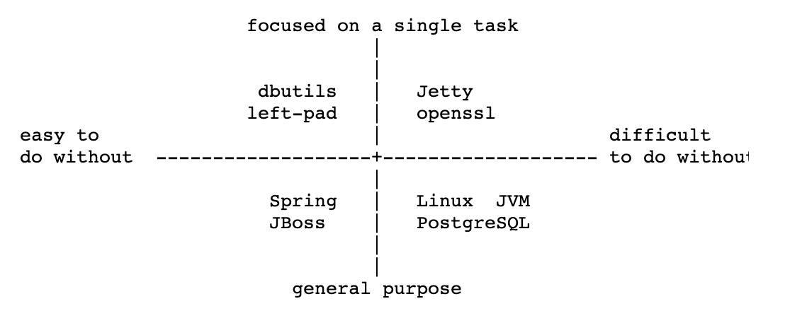

# 챕터 8 - 적합한 작업을 위한 적합한 도구

> 프로그래밍은 사회적 활동이다. - 로버트 C. 마틴

이제까지 배운 내용들로 프레임워크 없는 프론트엔드 애플리케이션을 작성할 수 있는 모든 준비가 됐다.

이번 장에서는 기술 결정을 내릴 때 명심해야 할 원칙들을 정의하고 이러한 원칙을 기반으로 실용적인 도구에 어떤 것들이 있는지 알아 본다.

## 자바스크립트 피로(Javascript fatigue)

2016년에 나온 표현이라고 한다. 최신 라이브러리나 프레임워크를 따라 가지 못하는 좌절감을 나타낸다.

자바스크립트는 다양한 곳에서 사용되고 있다.

(백엔드, 이더리룸 블록체인, 모바일 애플리케이션, IoT, NES 프로그래밍, 머신러닝, 알렉사 기술)

(저자는 자바스크립트 피로라는 표현에 동의하지 않는다고 합니다.)

프레임워크와 라이브러리는 학습에 효과적이므로 많아질수록 패러다임을 더 배울 수 있다.

지금은 **자바스크립트 르네상르**라고 부르고 싶고, 자바스크립트 개발자가 되기에 최적의 시기다.

## 적합한 프레임워크

‘선택’은 특정 프레임워크의 선택을 의미하는 것이 아니라 **체계적인 분석과 의사 결정 기법의 적용을 의미**한다.

프레임워크가 실제로 꼭 맞는 경우가 없으니 **충분히 좋은 프레임워크의 선택**으로 변경한다.

(완벽한 프레임워크를 찾고자하면 많은 시간과 비용이 소요된다.)

???

> 애자일 선언문의 중요 요점 중 하나인 **프로세스와 도구에 대한 개별적 상호 작용**에 동의한다.

결정을 내리는 팀과 그들이 서로 상호작용하는 방식에 집중하고 싶다.

## 안티패턴

### 노후화에 대한 두려움

자바스크립트 르네상스의 영향 중에는 많은 팀이 작업을 시작하자마자 스택이 이미 구식이 돼 버린 것이 아닌가 하는 두려움을 느끼게 됐다는 사실이 있다.

이 두려움 때문에 다음 프레임워크를 선택할 때는 오로지 인기에 편승해, 많은 사람들이 사용할수록 좋다고 판단하는 것이다. 하지만 문제는 프레임워크의 수명과 인기 사이에는 아무련 관련이 없다는 것이다.(지금까지 한국에서 리액트를 보면 이 의견에 동의하기가 힘드네요)

앵귤러JS의 인기는 대단했으나 앵귤러가 등장하자마자 시장에서 급격이 사라졌다.

(이 이야기를 들으니 리액트가 앵귤러 JS처럼 될 수 있을려나...?)

프로젝트의 라이프사이클에서 새로운 비즈니스 요구를 수용하지 못하게 될 때 소프트웨어(및 프레임워크)가 ‘레거시'가 된다고 생각한다.

예를 들면 새로운 개발자가 필요하지만 소프트웨어의 오래된 스택 때문에 작업할 수 있는 개발자를 찾을 수 없을 때가 바로 그런 때다.(Vue가 이렇게 될려나..)

프로젝트의 라이프사이클이란?

프로젝트 라이프사이클(Project Lifecycle)이란 프로젝트의 착수부터 종료 시점까지를 연속적인 단계로 나타낸 과정입니다. 프로젝트 라이프사이클은 프로젝트의 고유한 특성을 반영하는 체계이며, 산업 별로 고유한 형식이 존재합니다.

프로젝트 라이프사이클에 대한 이해와 적용은 프로젝트 관리의 가장 중요하고 기초적인 지식 분야 중의 하나입니다.

참조 : [http://baobab.pe.kr/study/355067](http://baobab.pe.kr/study/355067)

이런 시나리오는 스트랭글애플리케이션(StrangleApplication) 패턴이 좋은 리팩토링 방법이라고 한다.

새 애플리케이션을 기존 애플리케이션에 추가한다. 기존 애플리케이션이 스트랭글(없어지게)될 때까지 몇 년 동안 새 애플리케이션이 조금씩 성장하게 한다.

### 하이프 곡선 따르기

기대치가 최고점일때 프레임워크를 채택하지말고 하이프 곡선에 어느 위치인지 파악 후에 선택해라

5번째 단계가 안정화되니 이 위치에 있는 프레임워크를 사용하는 것이 좋을 것 같다.

### 일반적인 경로

10년전에 제이쿼리로 프로젝트를 성공했다면 모든 프로젝트에 제이쿼리를 사용할 것이다. 이는 일반적으로 개발 팀과의 협의 없이 일방적으로 마감일을 정하는 잘못 된 거버넌스 모델을 가진 회사에서 자주 일어난다.

**_거버넌스_**(governance)란 공동체를 이루는 구성원들이 의사결정에 참여하여 중요한 사항을 집단으로 결정하는 체계를 말한다. 협치(協治) 라고도 한다.

### 전문가

일부 회사에서는 모든 기술 결정이 ‘소프트웨어 아키텍처'나 ‘전문가'같은 높은 직책을 가진 일종의 전문가에 의해 이뤄진다.

이 사람이 중요한 결정을 내리는데 필요한 모든 정보를 갖고 있지 않을 수 있기 때문에 매우 위험한 접근 방식이다.

이 접근 방식의 위험성은 전문가가 갖고 있는 기술과는 전혀 관련이 없음을 명심하라.

기술의 문제가 아닌 부족한 정보의 문제다.

### 분노 주도 결정

프로젝트를 실패했을 때 자주 일어난다. 잘못된 프레임워크의 선택이라고 비난한다.

실패한 이유는 프레임워크를 제대로 사용하지 못하거나 잘못된 거버넌스 모델 때문이다.

## 프레임워크 없는 운동 선언문

이번 절에서는 프레임워크 없는 운동을 믿는 사람들이 기술적인 결정을 내려 할 때 따르는 원칙을 분석하고 일상적인 작업에 어떻게 활용할 수 있을지 알아본다.

### 첫 번째 원칙

> 소프트웨어의 가치는 코드 자체가 아니고 왜 코드가 존재하는지에 대한 이유다.

다시 말해 소프트웨어에 대한 신중한 결정(프레임워크 선택과 같은)을 내리려면 소프트웨어 개발의 이유를 명확히 해야 한다.

[https://82startupg1.xyz/entry/비즈니스-모델-캔버스](https://82startupg1.xyz/entry/%EB%B9%84%EC%A6%88%EB%8B%88%EC%8A%A4-%EB%AA%A8%EB%8D%B8-%EC%BA%94%EB%B2%84%EC%8A%A4)

### 두 번째 원칙

> 모든 결정은 콘텍스트를 고려해 내려야 한다. 특정 콘텍스트에서 결정한 좋은 선택이 다른 콘텍스트에서는 나쁜 선택이 될 수도 있다.

애플리케이션의 ‘콘텍스트'를 어떻게 정의할 것인가?

비기능적 요구 사항(NFR) 리스트를 사용하는 것이다.

우리는 기능적 요구 사항이 무엇인지, 소프트웨어가 무엇을 해야 하는지 정의하는 방법을 알고 있다.

일반적으로 사용자 스토리 형식으로 제공된다.

- 익명 사용자로 로그인해 프리미엄 영역에 접근하고 싶다.

비기능적 요구 사항(NFR)은 소프트웨어 애플리케이션이 수행해야 하는 작업이 아니라 소프트웨어 애플리케이션의 동작 방식을 정의하는 방법이다

- 익명의 사용자로 로그인해 1초 이내에 프리미엄 영역에 접근하고 싶다.

소프트웨어는 사용자가 1초이내에 로그인할 수 있을 정도로 성능이 우수해야 한다.

**요구사항 내용의 종류**에 따라서 기능적 요구사항과 비기능적요구사항을 나눌 수 있다.

정산하기나 모임 관리처럼 **시스템이 갖고 있는 기능**은 **기능적 요구사항**이라하고

정산하는 속도, 시스템의 메모리 사용량처럼 기능은 아니나 \*\*\*\*

**측정해서 제한을 두고 시스템이 만족하도록 해야 하는 것**은 **비기능적 요구사항**이라 한다.

[https://ee-22-joo.tistory.com/2](https://ee-22-joo.tistory.com/2)

### 세 번째 원칙

> 프레임워크의 선택은 기술적인 것이며 비즈니스 요구를 고려해 기술 담당자가 결정해야 한다.

예를 들어 스타트업이라면 TTM(Time To Market)을 줄이고자 고객의 피드백을 받는것이 필수적이다. 따라서 TTM을 줄이는 데 필요한 속도와 품질 사이에서 타협점을 찾아야 한다.

TTM이란 제품이 개발되고 실제로 ‘판매'되기까지 걸리는 시간(즉 서비스 개발부터 오픈때까지 걸리는 시간)

### 네 번째 원칙

> 프레임워크를 선택하게 한 의사 결정 기준을 팀의 모든 구성원에게 알려야 한다.

개발자는 어떠한 이유없이 결정을 내리면 안된다.

## 도구

프레임워크로 작업할지 여부를 선택할 때 사용할 수 있는 아주 간단한 기술적 의사 결정 도구들을 알아본다.

### 마테오 바카리의 도구

4분면을 통해 각각 프레임워크, 라이브러리 목록을 분류한다.

### 트레이드오프 슬라이더

### 프레임워크 나침반 차트

### 다른 도구
